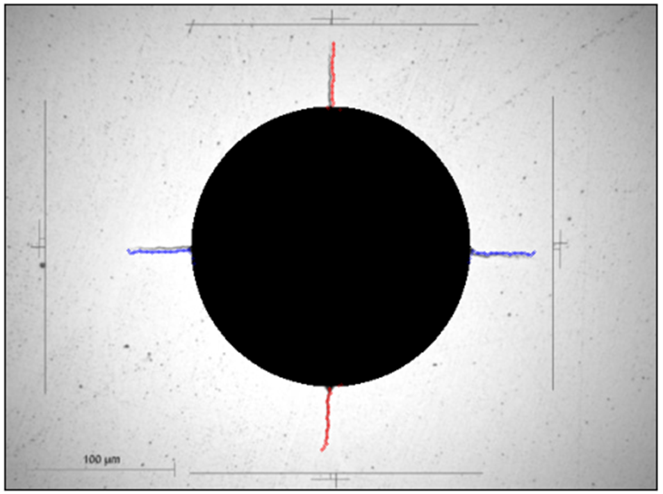

# Crack Analysis with OpenCV – Edge Detection, Measurement & Stitching

This repository contains Python code to **detect cracks**, **measure their length**, and **stitch multiple frames**
into a single panorama using **OpenCV** and related libraries. The work includes single‑image analysis (tensile & hardness),
batch processing across folders, automatic best‑image selection and duplicate removal (SSIM), and stitching with the
**Open Stitching** library.

> Stack: Python, OpenCV, NumPy, Matplotlib, scikit-image, pandas, Open Stitching, (optional) Fiji/ImageJ.

---

## 📂 Repository structure
```
.
├─ codes/
│  ├─ Canny_Edge_detection_tensile_images.py          # detect & measure crack in tensile image
│  ├─ Canny_Edge_detection_several_files.py           # batch processing across a folder
│  ├─ Canny_Edge_detection_hardness_test_images.py    # detect & measure up to 4 cracks in hardness image
│  ├─ Image_Stitching_Only.py                         # stitch images with Open Stitching
│  ├─ Select_best_quality_image_and_stitch.py         # Excel-based selection + SSIM de-dup + stitching
│  ├─ Run_Fiji_Stitching_Python.py                    # pairwise stitching via Fiji/ImageJ
│  └─ Run_Fiji_Stitching_Headless.py                  # headless Fiji runner
└─ images/
   ├─ fatigue_crack_measurement.png
   ├─ hardness_multi_cracks.png
   └─ stitched_crack_measurement.png
```

---

## 🧩 What each script does
- **`Canny_Edge_detection_tensile_images.py`** — Detects a single crack (small/large) in a tensile test image; computes **tip (x,y) in µm** and **total length** via a polyline derived from mean coordinates.
- **`Canny_Edge_detection_several_files.py`** — Batch version for a whole folder; writes `(tip_x, tip_y, total_length)` per image (assumes a known px/µm scale).
- **`Canny_Edge_detection_hardness_test_images.py`** — Detects up to **four cracks** in a hardness image; estimates scale from a green reference line and masks the indentation.
- **`Image_Stitching_Only.py`** — Stitches all images in a directory using Open Stitching (`nfeatures=1000`, plane warper, *no crop*, *no wave corr.*) to preserve scale.
- **`Select_best_quality_image_and_stitch.py`** — Reads test folders from Excel, picks the **sharpest** frame (edge count), removes **near-duplicates** (SSIM > 0.9), and stitches them.
- **`Run_Fiji_Stitching_Python.py`** — Pairwise stitching through Fiji/ImageJ from Python (Jython) until a single composite image remains.
- **`Run_Fiji_Stitching_Headless.py`** — Headless execution of the Fiji workflow for automation pipelines.

---

## 🖼️ Reference figures (selected)

**1) Tensile crack measurement (single image)**  
<br>
*Edge detection + centroid‑band filtering → polyline along the crack. The script reports crack tip offset (x,y) and total length in micrometers.*

**2) Hardness test — multiple cracks**  
<br>
*Four radial cracks detected around the indentation. The hardness script masks the impression and computes each radial length independently.*

**3) Stitched panorama + measurement**  
<br>
*Multiple frames of the same crack are stitched into a long panorama. Then the single‑image measurement algorithm is applied to obtain total length and tip position.*

---

## ⚙️ Installation
Clone this repository and install the required dependencies:

```bash
pip install -r requirements.txt
```

## ▶️ Notes
- Paths inside scripts are **examples** — adapt them to your filesystem.
- Tune Canny thresholds and centroid‑band width to your scale and image quality.
